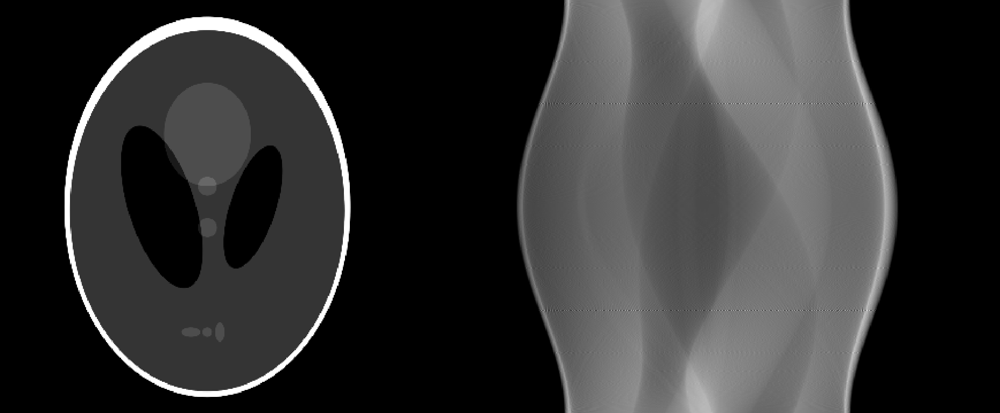

# radon-tf
Simple implementation of the radon transform. Faster when using more than one thread to execute it. No inverse function is provided. CPU implementation only.

## Setup
This is a header only library. Copy the contents of `radon/` or add it in the include search path into your project. Then simply `#include "radon.hpp`.

## How to Use
Take a look at `app/radon-tf.cpp` or `benchmarks/cpu.cpp`.